

  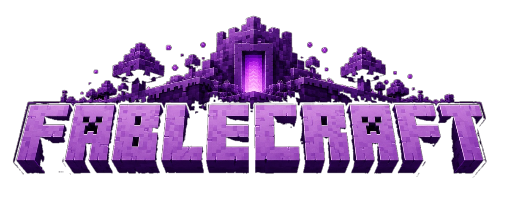

  <b>⛏️ Dig. 🏗️ Build. 🧪 Brew. ✨ Cast. 🐉 Slay the Dragon.</b> 
  <i>A free and open source voxel survival RPG that runs entirely in your browser.</i>

## 🎮 What is this?

FableCraft is an original voxel survival RPG, released free and open source under the MIT
license. You design your own hero, then mine, build, brew potions, cast spells, trade with
villagers, raid dungeons and their guardians, and finally step through the **WAVE ARENA**
portal to clear three enemy waves and face a multi-phase Dragon Boss.

There is no backend, no build step, no accounts, no tracking and no external requests. Clone
the repo, open `index.html`, and it runs.

Everything in the game is generated in code at runtime. Block textures are painted onto
canvases, all sounds and music are synthesized with the Web Audio API, and every model is
built from boxes. The UI uses the open source pixel fonts **VT323** and **Press Start 2P**
(SIL Open Font License, vendored locally). The assets are 100% original and copyright free,
so feel free to fork it, reskin it and ship it. 🚀

## ✨ Why "Fable"?

The whole game was written with **Claude Fable 5**, during the window when Fable 5 first
launched, back when it was still the original un-nerfed release. The name is a nod to the
model that built it. Every line of code, every procedural texture, every synthesized sound
effect and every boss fight came out of that collaboration. FableCraft is the artifact of
what that version could do in one sitting.

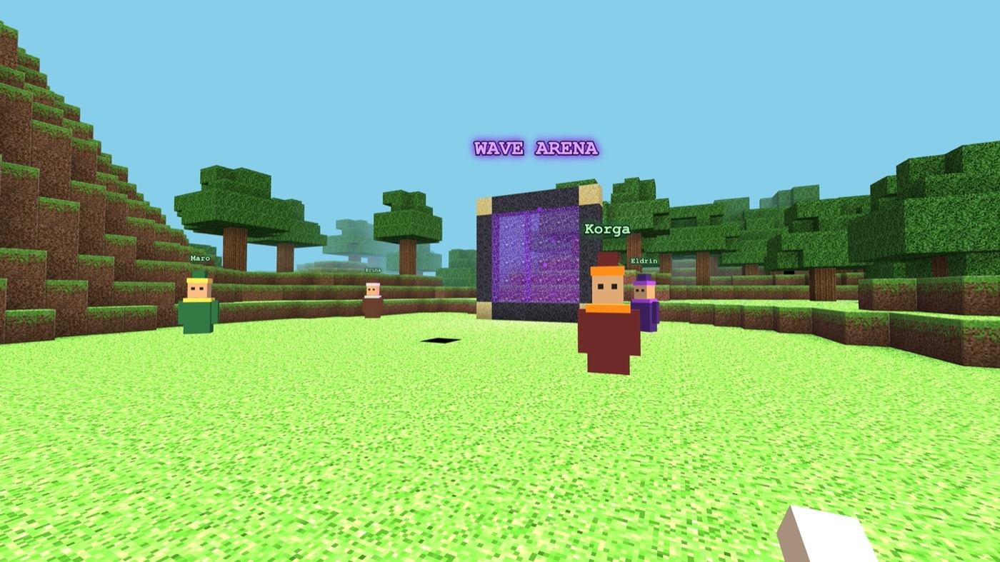

## 🖼️ Screenshots

| | |
|---|---|
| 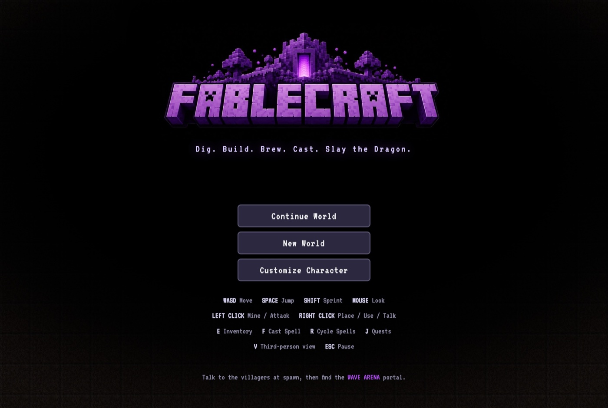 | 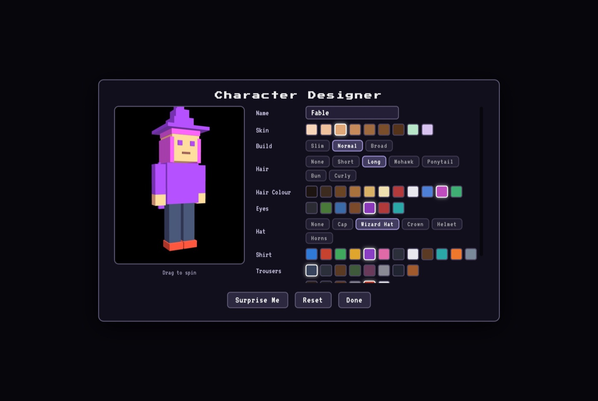 |
| 🕹️ **Main menu**: pick up where you left off or roll a fresh world | 🎨 **Character designer**: skin, build, hair, eyes, hats, capes and a live 3D preview |
| 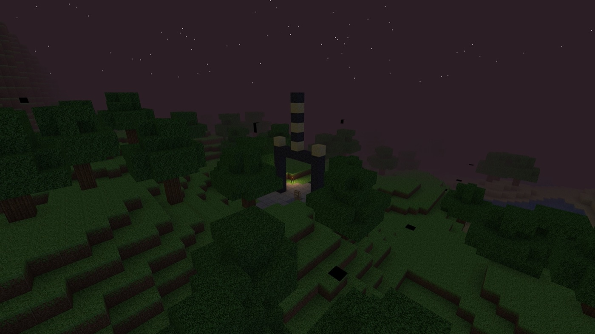 | 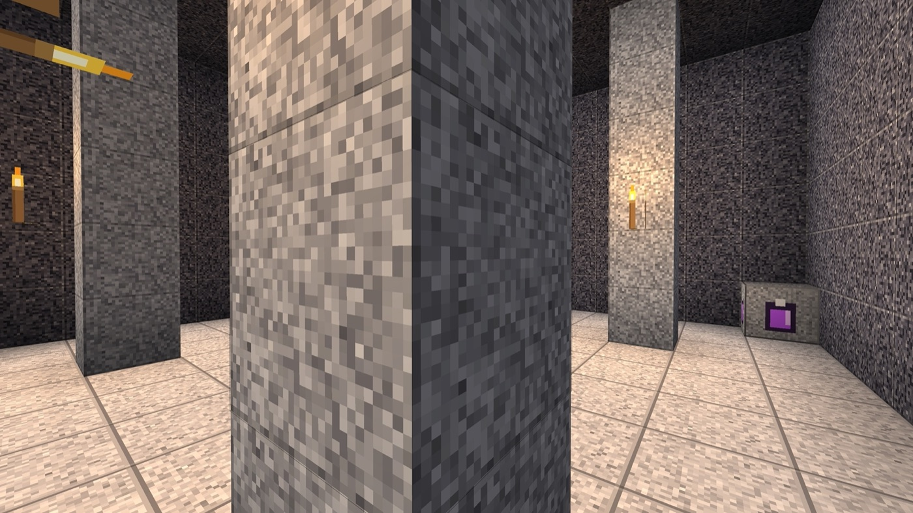 |
| 💀 **Catacombs**: a lit beacon you can spot across the treeline | 🔦 **The crypt below**: pillars, torches and a rare chest |
| 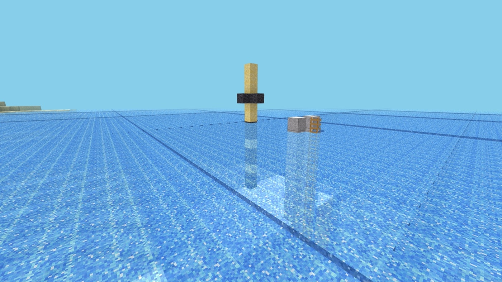 | 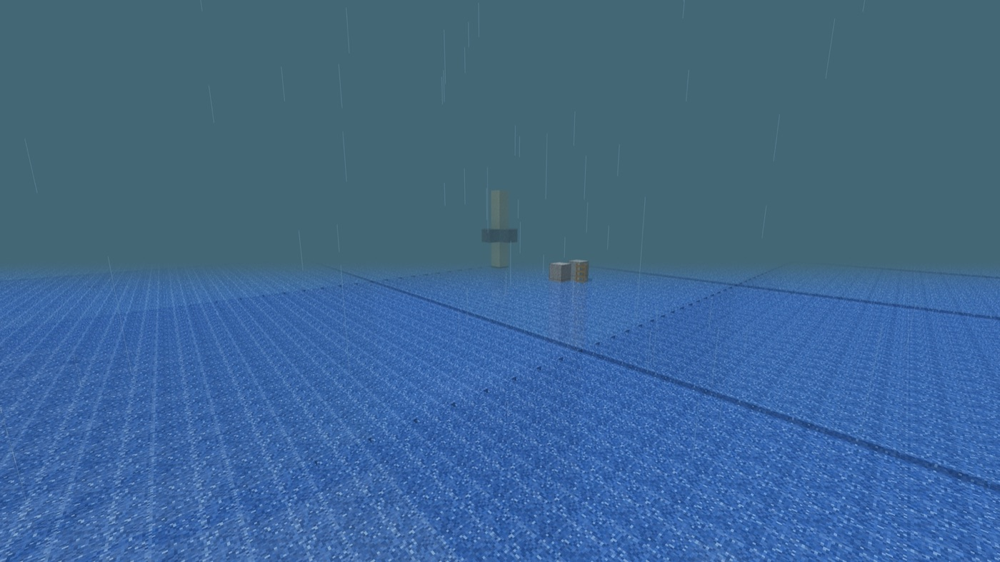 |
| 🌊 **Sunken Temples**: a spire marks the flooded ruin below | ⛈️ **Weather**: rain, fog and lightning storms |
| 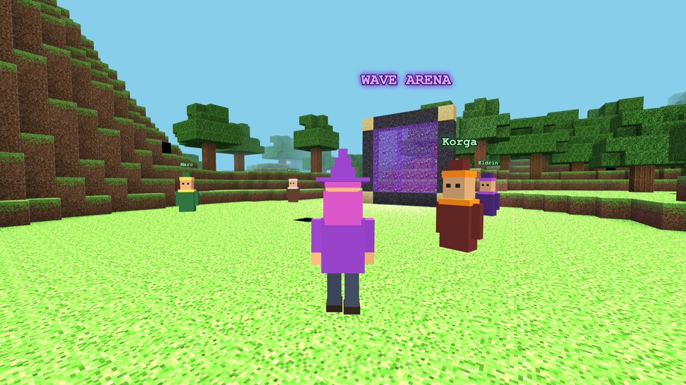 | 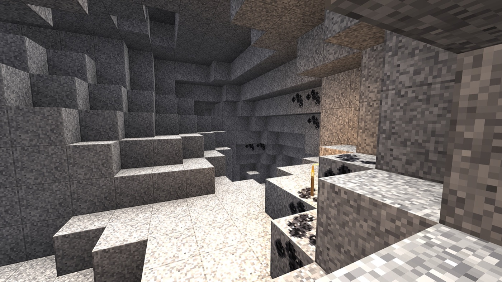 |
| 🧍 **Your hero**: build one, then press `V` to watch them run | 💎 **Caves and ores**: coal, iron, gold and crystal, by depth |
| 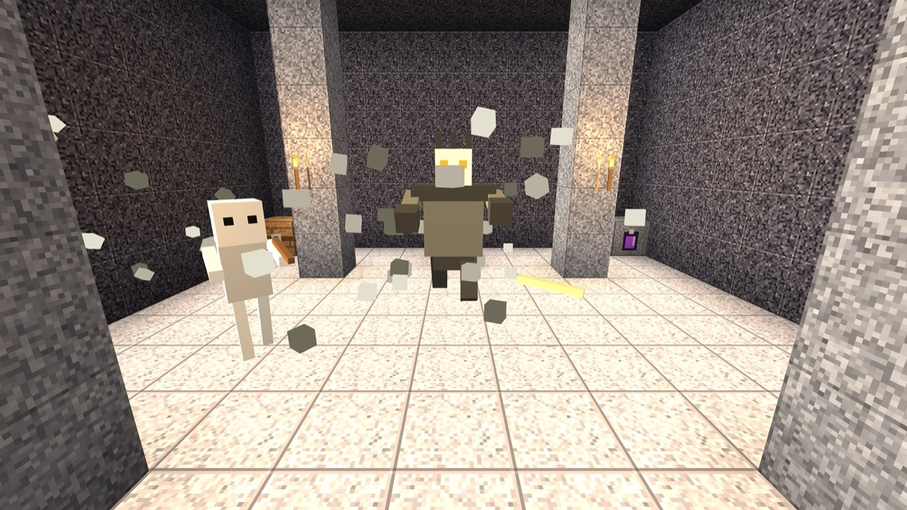 | 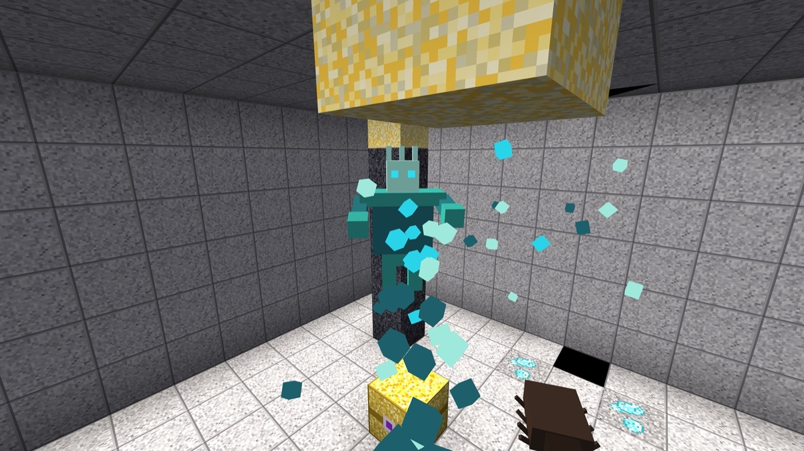 |
| ☠️ **The Bone Warden**: the Catacombs guardian raises the dead | 🔱 **The Tide Warden**: drags you in and floods the chamber |
| 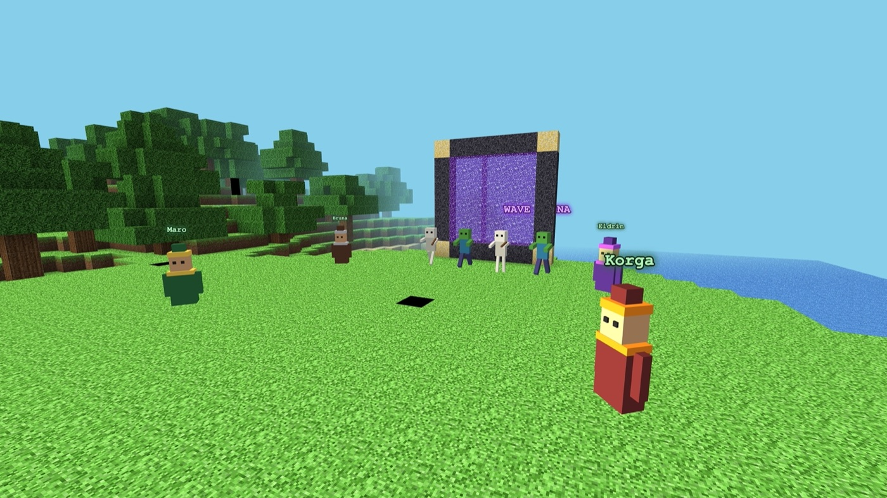 | 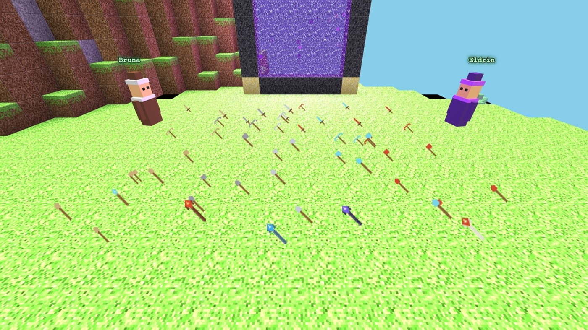 |
| 🔮 **Magic**: seven spells, five upgrade ranks each | ⚔️ **Gear**: every sword, pickaxe, axe and shovel in five tiers, plus five staves |
| 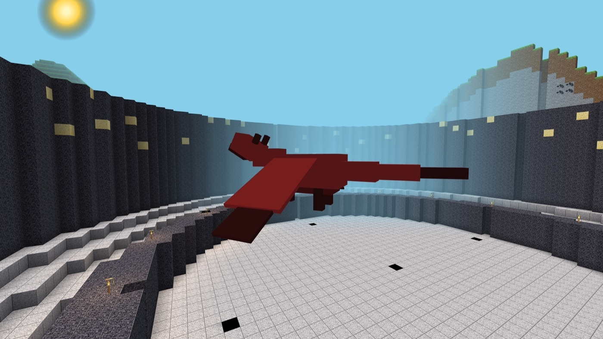 | |
| 🐉 **The Ancient Dragon**: three phases at the end of the Wave Arena | |

## ▶️ Play it

FableCraft is a fully static site, with Three.js r147 and the fonts vendored locally.

- **Local:** open `index.html` in any modern browser, or serve the folder
  (`python3 -m http.server`) and visit `http://localhost:8000`.
- **Hosting:** drop the folder onto GitHub Pages, Cloudflare Pages, Netlify or any static host.

## 🧍 Character designer

Every player builds their own voxel hero before they spawn, either from the title screen
(**Customize Character**) or the pause menu (**Character**):

- Name, body build (slim / normal / broad) and 9 skin tones
- 7 hair styles (short, long, mohawk, ponytail, bun, curly) in 11 colours
- 7 eye colours, 6 hats (cap, wizard hat, crown, helmet, horns) and optional capes
- Shirt, trousers and boot colours from a 12 colour palette
- Live 3D preview you can drag to spin, plus a **Surprise Me** randomizer

Your hero is saved separately from the world, so it follows you into every new game. It
colours your first-person arms, and pressing **V** drops into third person so you can watch
yourself run, swim and fight.

## 🕹️ Controls (rebindable in Settings)

| Input | Action |
| --- | --- |
| `W A S D` | Move |
| `Mouse` | Look |
| `Space` | Jump / swim up / climb |
| `Shift` | Sprint (uses stamina) |
| `Left click` | Mine block (hold) / attack |
| `Right click` | Place block · use stations · open doors/chests · talk to NPCs · drink potions |
| `E` | Inventory, equipment and field crafting |
| `F` | Cast the active spell |
| `R` | Cycle spells |
| `J` | Quest log |
| `Q` | Drop the held item (hold `Shift` to drop the whole stack) |
| `V` | Toggle third person view |
| `1-9` / wheel | Hotbar slot |
| `Esc` | Pause menu |

## 🌍 The world

Every seed draws one of eight world types (Verdant Plains, Highland Peaks, Sunken
Archipelago, Ancient Forest, Arid Badlands, Hollow Karst, Rolling Downs, Shattered Isles)
and then jitters its numbers, so continent size, mountain height, sea level, tree density
and cave frequency all differ between worlds.

- 🏔️ **Procedural terrain:** plains, forests, mountains and lakes, streamed in 16×16×128
  chunks with per-vertex ambient occlusion and a full day and night cycle.
- 🕳️ **Caves and ores:** 3D noise cave networks with underground lakes, plus coal, iron, gold
  and crystal veins that need progressively better pickaxes.
- 🏘️ **Structures:** villages, wizard towers, ruins, abandoned mines and watch towers generate
  in the wild, stocked with treasure chests (rare golden chests hold the best loot).
- 🗝️ **Dungeons:** Catacombs marked by a glowing surface archway, and Sunken Temples marked by
  a spire that breaks the water. A HUD compass points at the nearest one.
- ⛈️ **Weather:** rain, lightning storms and fog banks, with matching ambience.
- 🏊 **Swimming:** dive with an oxygen meter, drowning damage and underwater fog.

## ⚔️ Systems

- 🔮 **Magic:** mana bar and 7 spells (Fireball, Ice Spike, Healing Light, Lightning Bolt,
  Blink Dash, Earth Wall, Meteor Strike) unlocked by leveling, Spell Books or beating the
  Dragon. Each spell upgrades 5 ranks at the Wizard.
- 🔨 **Crafting:** field crafting for basics, plus a Crafting Table that opens a categorized
  workshop (Weapons / Tools / Armor / Magic / Utility) with 50+ recipes. Swords, pickaxes,
  axes and shovels each come in five materials (**wood → stone → iron → crystal → dragon**),
  with better tools mining faster and reaching ores the weaker ones cannot break. Magic
  implements run Wand → **Ember** → **Frost** → **Storm** → **Dragonbone Staff**, each
  multiplying the power of every spell you cast while held.
- 🧪 **Brewing:** the Brewing Station turns herbs and reagents into 8 potion types (health,
  mana, stamina, speed, strength, regeneration, fire resistance, dragon slayer).
- 🛡️ **Equipment:** 8 gear slots (helmet, chest, legs, boots, weapon, shield, ring, amulet).
  Armor reduces damage while trinkets add health, mana, regen and damage bonuses.
- 🧙 **NPCs:** Maro the Merchant (buy and sell), Bruna the Blacksmith (forge upgrades), Eldrin
  the Wizard (spell training) and Korga the Arena Master (lore and quests) live at spawn.
- 📜 **Quests:** a 10 quest chain running from "mine 10 blocks" to "slay the Dragon", with XP,
  coin and item rewards (press `J`).
- 🎁 **Level 10 reward:** hitting level 10 conjures a golden chest beside you holding a full
  Dragon armor set and the best gear in the game.
- ☠️ **Dungeon bosses:** each dungeon has a guardian that wakes when you enter its chamber,
  with a health bar, an enrage phase at half health, and a guaranteed piece of top tier loot.
  The **Bone Warden** summons risen dead, hurls bone shrapnel and slams the floor. The
  **Tide Warden** drags you in with a whirlpool, fires water lances and calls up drowned
  crawlers. Flee the room and the guardian resets, so you can come back better equipped.
- 🐉 **Arena:** 3 escalating waves, then a 3 phase, 5 ability dragon with fireball barrages,
  fire breath, dive attacks, tail swipes, roar shockwaves and falling fire.

The game auto-saves everything to `localStorage` every 20 seconds: world seed and edits,
inventory, equipment, spells, chest contents, quest progress, weather, stats, settings and
key bindings.

## ⚙️ Settings and accessibility

Graphics quality, render distance, volume mixers, mouse sensitivity, fullscreen, full key
rebinding, adjustable UI scale, a colorblind friendly palette (Okabe-Ito) and sound subtitles.

## 🛠️ Tech

- Plain HTML, CSS and JavaScript with [Three.js](https://threejs.org) (r147, MIT, vendored).
- Textures are painted at runtime into a 256×256 atlas of 32px tiles. Palettes are enriched
  with derived highlight and shadow tones, then finished with grain, cracks and a lit edge
  bevel so every block reads with depth.
- Optimizations: face culled chunk meshing with baked ambient occlusion, height capped
  generation, cached neighbour chunk lookups, frustum culling, instanced particle rendering,
  pooled point lights, damage numbers and projectiles, distance throttled AI, time boxed
  chunk streaming, and a quality scaler for pixel ratio and particle density.

## 🤝 Contributing

Issues and pull requests are welcome. New biomes, blocks, spells, dungeon types and bosses
are all natural places to extend the game. The codebase is plain JavaScript with one module
per system (`js/world.js`, `js/spells.js`, `js/dungeons.js` and so on) and no build tooling,
so you can edit a file and refresh the page.

## ℹ️ About this project

FableCraft is **free and open source**, and it exists as a demonstration of what the
**Claude Fable 5** model could build. I do not make any money from it and I have no plans to.
There is nothing to buy, no ads, no tracking and no accounts. Take it, learn from it, fork it.

It is **inspired by Minecraft**, and that inspiration is obvious in the block grid, the mining
and the crafting. It shares no code, no assets and no files with Minecraft. Every texture,
sound, model, animation and line of code in this repository was made from scratch for this
project, most of it generated procedurally at runtime. Minecraft is a trademark of Mojang
Studios, who are not affiliated with this project and have not endorsed it. This is a personal
tribute and a technical demo, nothing more.

## 📜 License

Released under the **MIT License**, see [LICENSE](LICENSE). You are free to use, modify,
distribute and sell this, including commercially, with attribution.

All game code, textures, models, sounds and music are original work created for this project.
The only third party pieces are [Three.js](https://threejs.org) (MIT) and the VT323 and
Press Start 2P fonts (SIL Open Font License), both vendored locally in this repo.
